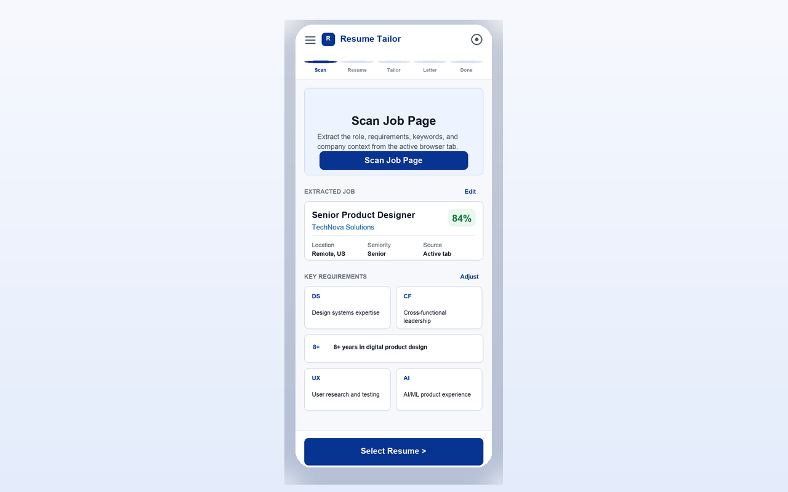
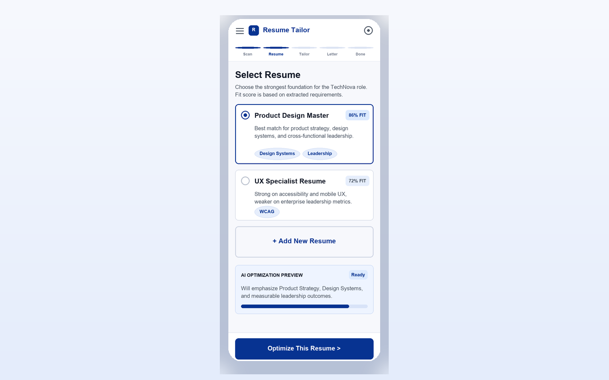
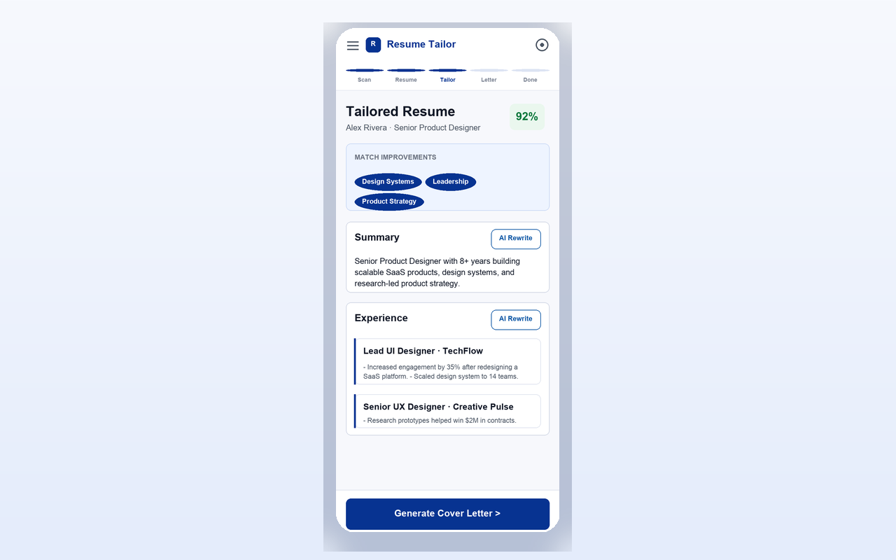
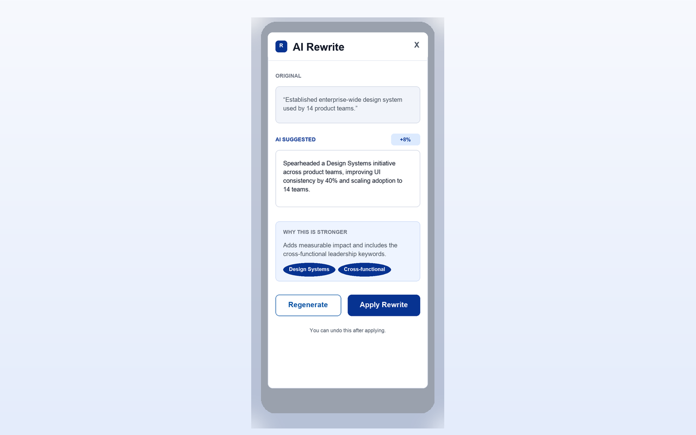
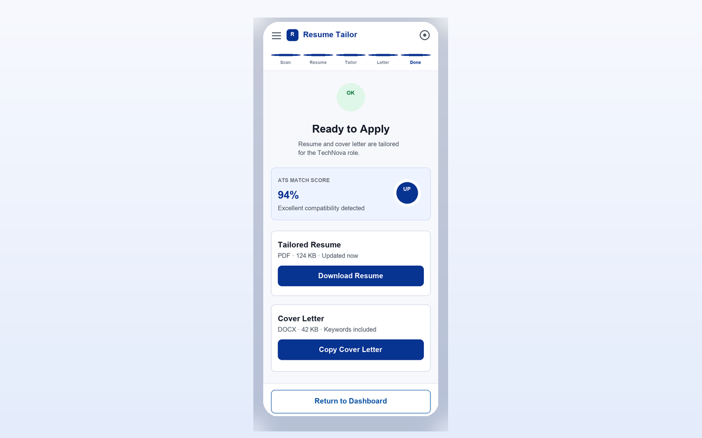

# Resume Tailor

**Resume Tailor** is a **local-first Chrome extension (Manifest V3)** that helps you align your résumé and cover letter with the job description on the page you are viewing. You bring your own **OpenAI-compatible API key**; requests go to the provider you choose (for example OpenAI or DeepSeek). There is no login, no custom backend, and no cloud sync in this project.

---

## What it does

| Step | What you do | What the extension does |
|------|-------------|-------------------------|
| **Scan job** | Open a job posting in a tab, then run the scan from the extension. | Reads text from the **active tab** (after your action), then uses AI to extract title, company, **key requirements**, and **keywords**. |
| **Resume** | Upload a **PDF** résumé or work with a stored one. | Parses the PDF into structured sections (with AI or local fallback, depending on provider and settings). You can keep multiple résumés and pick one. |
| **Tailor** | Edit sections and use **AI rewrite** where offered. | Compares your résumé to the scanned job, suggests alignment, and supports section-level editing and previews (including PDF-oriented flows where implemented). |
| **Cover letter** | Choose which **keywords**, **requirements**, and **résumé excerpts** to include, then generate. | Builds a cover letter from your selections; you can **copy** or **download a PDF**. |

Your **API key** and parsed data are stored **locally** in the extension (Chrome `storage`). The extension does not send your résumé or letters to a separate app server defined in this repo.

---

## Contact

- **Email:** [jiajunliu0024@gmail.com](mailto:jiajunliu0024@gmail.com) — privacy policy, Chrome Web Store listing, or general questions about this project.
- **GitHub Issues:** [github.com/jiajunliu0024/ai-resume/issues](https://github.com/jiajunliu0024/ai-resume/issues) — bug reports and feature discussion (update the URL if you use a fork).

---

## Requirements

- **Google Chrome** (or another Chromium browser that supports Manifest V3 extensions).
- **Node.js** (for building from source; use a version compatible with the toolchain listed in `package.json` / lockfile).
- A valid **API key** for your chosen provider (host permissions in `public/manifest.json` include the provider API hosts used by the app).

**Where to get keys / which tiers are often cheapest to try:** see **[`docs/AI_PROVIDER_API_KEYS.md`](docs/AI_PROVIDER_API_KEYS.md)** (signup links + free-/trial-oriented notes).

---

## Install from source (Chrome)

1. Clone the repository and install dependencies:

   ```bash
   npm install
   ```

2. Build the extension:

   ```bash
   npm run build
   ```

3. In Chrome, open **`chrome://extensions`**, enable **Developer mode**, click **Load unpacked**, and select the **`dist`** folder produced by the build.

4. Pin the extension if you like. Use the extension toolbar action to open the UI (the project may inject a **floating panel** on the page depending on how you invoke it—behavior follows `src/extension/background/background.ts`).

---

## Development

```bash
npm install
npm run dev
```

Opens the Vite dev server for the popup UI. Full Chrome APIs (tabs, storage, scripting) only work when the app runs **inside the loaded extension**, not only in a plain browser tab.

Quality checks used in this repo:

```bash
npm run verify   # lint + TypeScript + production build
npm run lint     # ESLint only
npm run typecheck
```

---

## Privacy policy (Chrome Web Store)

Google requires a **public HTTPS URL** that loads your privacy policy when the extension handles user data.

### URL to paste in the Chrome Web Store

Use the **direct** policy page only (no redirects, no site root):

`https://<your-github-username>.github.io/<repository-name>/privacy-policy.html`

Example: `https://jiajunliu0024.github.io/ai-resume/privacy-policy.html`

The policy text lives in this repo as [`docs/privacy-policy.html`](docs/privacy-policy.html).  
[`docs/PRIVACY_POLICY.md`](docs/PRIVACY_POLICY.md) is the same content in Markdown for editing.

[`docs/index.html`](docs/index.html) is an optional **static** landing page at the site root (manual link only — **do not** use the root URL as the store policy link).  
[`docs/.nojekyll`](docs/.nojekyll) disables the default Jekyll build for the publishing folder ([official note](https://docs.github.com/en/pages/getting-started-with-github-pages/creating-a-github-pages-site#static-site-generators)).

### GitHub Pages rules (official documentation)

These links describe how publishing works; they are not project-specific advice:

| Topic | Official doc |
|-------|----------------|
| Project site URL (`https://<owner>.github.io/<repositoryname>`) | [About GitHub Pages — Types of sites](https://docs.github.com/en/pages/getting-started-with-github-pages/about-github-pages#types-of-github-pages-sites) |
| Publishing from `/` or `/docs` on a branch | [Configuring a publishing source — Publishing from a branch](https://docs.github.com/en/pages/getting-started-with-github-pages/configuring-a-publishing-source-for-your-github-pages-site#publishing-from-a-branch) |
| Entry file (`index.html`, `index.md`, or `README.md` at the top of the publishing folder) | [Creating a GitHub Pages site — Creating your site](https://docs.github.com/en/pages/getting-started-with-github-pages/creating-a-github-pages-site#creating-your-site) |
| Disabling Jekyll with `.nojekyll` | [Creating a GitHub Pages site — Static site generators](https://docs.github.com/en/pages/getting-started-with-github-pages/creating-a-github-pages-site#static-site-generators) |

Ensure the branch and folder selected in **Settings → Pages** (e.g. `feature-ui` + `/docs`) match the branch where `docs/privacy-policy.html` exists, then push and wait for deployment (GitHub notes delays up to ~10 minutes in some cases: [Viewing your published site](https://docs.github.com/en/pages/getting-started-with-github-pages/creating-a-github-pages-site#viewing-your-published-site)).

---

## How to use (walkthrough)

Below, screenshots are taken from the promotional captures in [`public/store-promo/`](public/store-promo/) so the README stays self-contained in the repo. Your live UI may differ slightly as the product evolves.

### 1. Scan the job page

Open the job listing in a normal tab. In **Resume Tailor**, go to **Scan job**, add your **API key** in **Settings** if you have not already, then tap **Scan current page**. Review extracted requirements and keywords before continuing.



### 2. Select or upload your résumé

On **Resume**, upload one or more **PDF** files or select an existing parsed résumé. The flow uses the scanned job context when you arrived from the scan step.



### 3. Tailor your résumé to the job

On **Tailor**, edit structured sections, review match hints, and use **AI rewrite** where available so wording reflects the job without inventing experience you did not provide.



### 4. Use AI rewrite where it helps

Section-level AI tools let you refine bullets and summaries while you stay in control of what you accept.



### 5. Generate your cover letter

On **Cover letter**, tick the **keywords**, **requirements**, and **résumé snippets** you want included, run **Generate**, then **copy** or **Download PDF**.



---

## Project layout (short)

| Path | Role |
|------|------|
| `src/app/` | React UI: pages, components, styles. |
| `src/application/` | Use cases (scan, parse résumé, tailor, cover letter). |
| `src/domain/` | Types and domain concepts. |
| `src/infrastructure/` | AI adapters, Chrome storage, PDF parsing and PDF output. |
| `src/extension/` | Background service worker, content scripts, tab helpers. |
| `public/manifest.json` | Extension manifest (copied into `dist` by the build). |

For product rules, privacy expectations, and architecture boundaries, see **[`AGENTS.md`](AGENTS.md)**.
