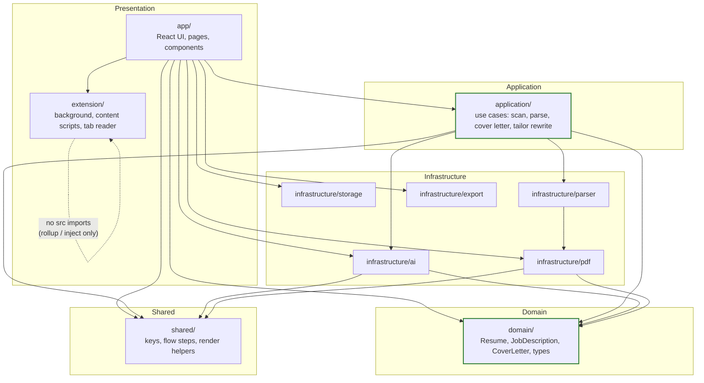
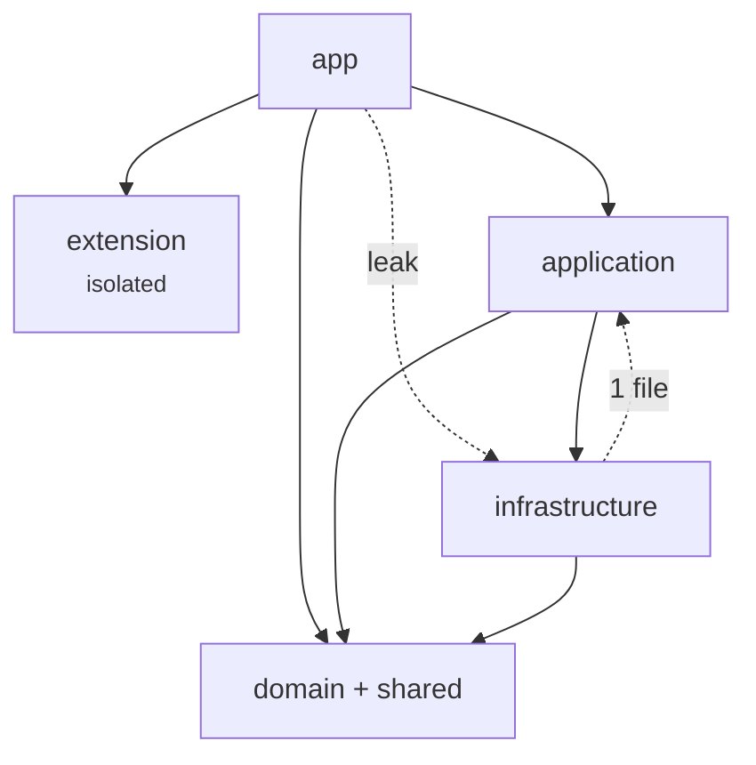
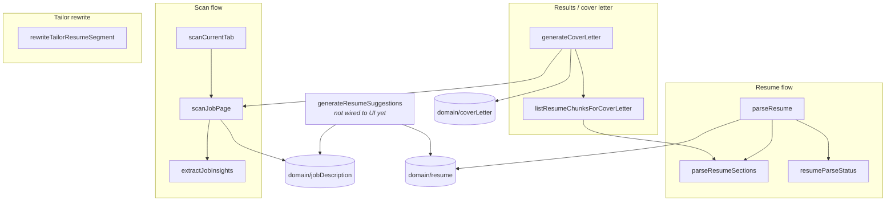
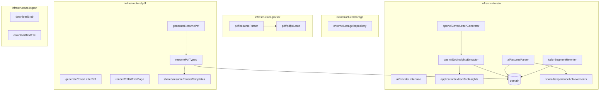
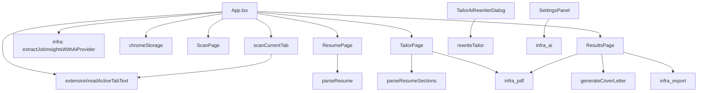
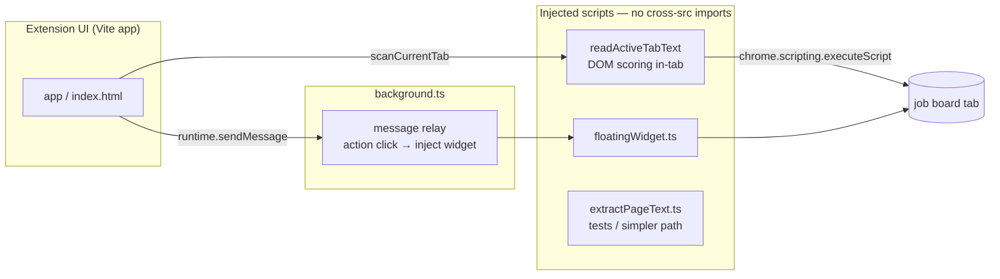
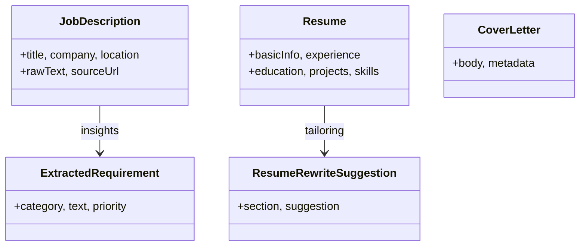

# Architecture: Layered View & Module Dependency Map

Generated from `src/**/*.ts(x)` import analysis. Update when you add layers or change cross-folder imports.

**Sequence diagrams (per flow):** [SEQUENCE_DIAGRAMS.md](./SEQUENCE_DIAGRAMS.md)

## 1. Layered architecture (intended)



**Intended rule:** UI and extension adapters call **application** use cases; use cases call **domain** + **infrastructure**; **domain** and **shared** do not import upward.

---

## 2. Cross-layer dependencies

Only **six** top-level folders matter. Normal flow is **down the stack**; anything else is called out as an exception.

### 2.1 Layer stack (top = callers, bottom = no upward imports)

```
  app ─────────────── React UI (popup / side panel)
    │
    ├─► application ─ use cases
    ├─► extension ─── Chrome-only adapters (tab inject, widget; no src imports)
    ├─► infrastructure  (some pages skip application — see leaks)
    ├─► domain ──────── types for props / display
    └─► shared ──────── flow labels, keys, small helpers

  application ──► domain, shared, infrastructure

  infrastructure ─► domain, shared
                    └─► application  ⚠ one reverse edge (see below)

  domain, shared ──► (nothing in src/)
  extension ───────► (nothing in src/ — constants duplicated for inject bundles)
```

### 2.2 Allowed edges (9 relationships)

| From | To | What |
|------|-----|------|
| `app` | `application` | Scan, parse, cover letter, tailor rewrite |
| `app` | `extension` | `readActiveTabText` for scan |
| `app` | `domain` | Types on pages (`Resume`, `ExtractedRequirement`, …) |
| `app` | `shared` | `storageKeys`, `appFlowSteps` |
| `application` | `domain` | All use cases |
| `application` | `shared` | e.g. `experienceAchievements` in `parseResumeSections` |
| `application` | `infrastructure` | AI parsers, PDF text extract, cover letter API |
| `infrastructure` | `domain` | AI/PDF types |
| `infrastructure` | `shared` | e.g. `resumeRenderTemplates`, `experienceAchievements` |

No other cross-folder imports exist today (except the two rows below).

### 2.3 Exceptions only (2 items)

| Kind | From | To | Detail |
|------|------|-----|--------|
| Reverse | `infrastructure/ai/openAiJobInsightsExtractor.ts` | `application/extractJobInsights.ts` | AI adapter reuses heuristic JD helpers |
| UI leak | `app` (pages/components) | `infrastructure` | Settings, PDF preview, export, some AI types — not routed through a use case |

**`app` → `infrastructure` touch points:** `App.tsx`, `SettingsPanel`, `ResumePage`, `TailorPage`, `ResultsPage`, `TailorAiRewriterDialog`, PDF preview modals.

### 2.4 One diagram (optional)

If you want a picture, use this **5-node** version only — not a full mesh.



**How to read:** solid = normal; dashed = exception. `extension` has no arrow to other layers (by design).

---

## 3. Application layer (use cases)



| Module | Role |
|--------|------|
| `scanCurrentTab` | Orchestrates tab read + `scanJobPage` |
| `scanJobPage` | Raw page → `JobDescription` + heuristic insights |
| `extractJobInsights` | Pure/heuristic JD parsing (also used by OpenAI adapter) |
| `parseResume` | PDF/text → structured `Resume` via infra parsers + AI |
| `parseResumeSections` | Section model + `shared/experienceAchievements` |
| `resumeParseStatus` | Parser version / parsed flag |
| `generateCoverLetter` | Chunks resume + calls OpenAI cover letter |
| `listResumeChunksForCoverLetter` | Resume → prompt chunks |
| `rewriteTailorResumeSegment` | Tailor section AI rewrite |
| `generateResumeSuggestions` | Placeholder use case (interface in `aiProvider` only) |

---

## 4. Infrastructure submodules



---

## 5. App → backend wiring (main UI paths)



**Scan path:** `App` → `scanCurrentTab(readActiveTabText)` → `scanJobPage` → (optional) `extractJobInsightsWithAiProvider` in `App`.

**Resume path:** `ResumePage` → `parseResume` → `aiResumeParser` / `pdfResumeParser`.

**Results path:** `ResultsPage` → `generateCoverLetter` → `openAiCoverLetterGenerator`; PDF/export via infrastructure.

---

## 6. Extension (runtime, separate bundles)



---

## 7. Domain model (types only)



Files: `domain/jobDescription.ts`, `domain/resume.ts`, `domain/coverLetter.ts`.

---

## 8. Shared utilities

| File | Used by |
|------|---------|
| `storageKeys.ts` | `app/App` |
| `appFlowSteps.ts` | pages, `StepProgress` |
| `experienceAchievements.ts` | `application/parseResumeSections`, `infrastructure/ai/aiResumeParser`, `app/TailorPage` |
| `resumeRenderTemplates.ts` | `infrastructure/pdf/resumePdfTypes` |
| `floatingWidgetMessages.ts` | duplicated in extension (no import) |

---

## Regenerating this map

From repo root, list cross-layer imports:

```bash
rg "from ['\"].*/(application|domain|infrastructure|shared|extension|app)/" src -g '*.{ts,tsx}'
```

Optional tooling: [dependency-cruiser](https://github.com/sverweij/dependency-cruiser) with a rule set matching `src/{app,application,domain,infrastructure,shared,extension}`.
