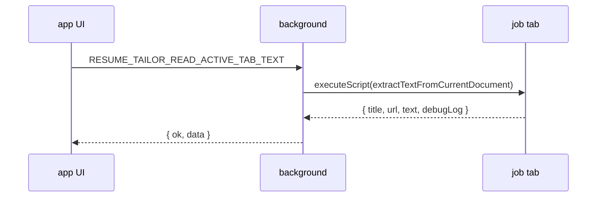

# Job page scan: permissions and execution model

How the extension reads job description text from the active browser tab, and why older “inject a bridge + message” approaches were removed.

**Related:** [ARCHITECTURE.md](./ARCHITECTURE.md) · [SEQUENCE_DIAGRAMS.md](./SEQUENCE_DIAGRAMS.md)

---

## 1. Current scan path (simple)

| Step | Where | What |
|------|--------|------|
| 1 | `app/App.tsx` | User clicks Scan |
| 2 | `extension/tabs/readActiveTabText.ts` | `runtime.sendMessage` → service worker |
| 3 | `extension/background/background.ts` | `RESUME_TAILOR_READ_ACTIVE_TAB_TEXT` |
| 4 | `extension/scan/extractActiveTabPageText.ts` | **One** `scripting.executeScript({ func: extractTextFromCurrentDocument })` |
| 5 | `extension/content/jobPageTextExtractor.ts` | DOM scoring (serialized into the tab by Chrome) |



- **No** `tabs.sendMessage` to the page (avoided “message port closed” from the floating iframe).
- **No** `scanPageTextBridge` content script on every load (avoided duplicate listeners and SPA races).
- **No** two-step “inject file, then call global” (avoided “helper not loaded” flakes).

Retries: up to 3 attempts with short backoff (helps SPAs that are still painting).

---

## 2. Permissions

```json
"host_permissions": ["http://*/*", "https://*/*", …AI APIs…]
```

| Permission | Used for |
|------------|----------|
| `http://*/*`, `https://*/*` | `executeScript` on the job tab when user scans |
| AI API hosts | `fetch` to the user’s provider |
| `content_scripts` (listed job sites only) | **Floating widget only** — not scan |

---

## 3. Why older inject designs failed often

| Approach | Typical failure |
|----------|----------------|
| `tabs.sendMessage` from floating iframe | “The message port closed before a response was received” |
| Manifest + dynamic inject of `scanPageTextBridge` | Two listeners; wrong listener wins |
| Inject bridge then call `globalThis.__resumeTailorExtract…` | Navigation / SPA: global missing on second step |
| `executeScript(func)` from iframe without host access | “Cannot access contents of the page” |

---

## 4. Operator checklist

1. Reload extension on `chrome://extensions`.
2. Refresh the job posting tab.
3. Run **Scan Current Page** (keep the job tab open; loading UI shows two phases: read page → AI).

If scan fails after reload: note the site URL and whether the floating panel or popup was used.

---

## 5. Maintainer files

| File | Role |
|------|------|
| `src/extension/content/jobPageTextExtractor.ts` | DOM extraction (must stay self-contained for `executeScript` serialization) |
| `src/extension/scan/extractActiveTabPageText.ts` | Background-only scan orchestration |
| `src/extension/tabs/readActiveTabText.ts` | UI → background adapter |
| `src/extension/background/background.ts` | Message handler |
| `public/manifest.json` | `host_permissions`; `content_scripts` = floating widget only |

**Do not** re-add a scan-specific content script unless there is a proven need; prefer improving `jobPageTextExtractor.ts` selectors instead.
