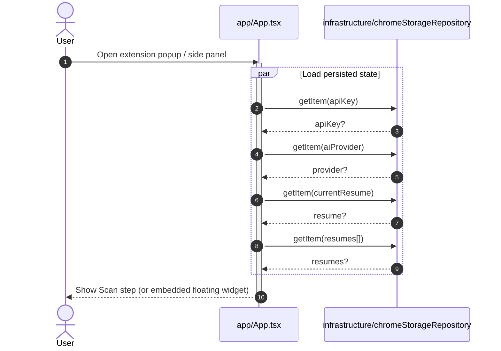
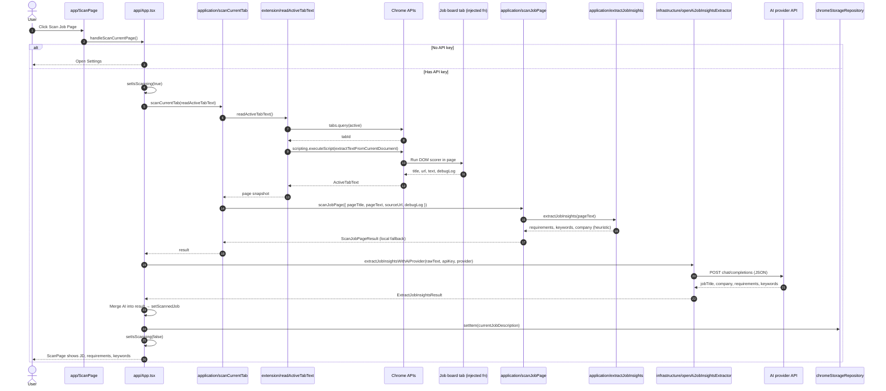
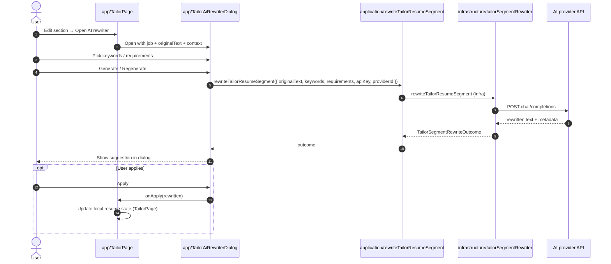
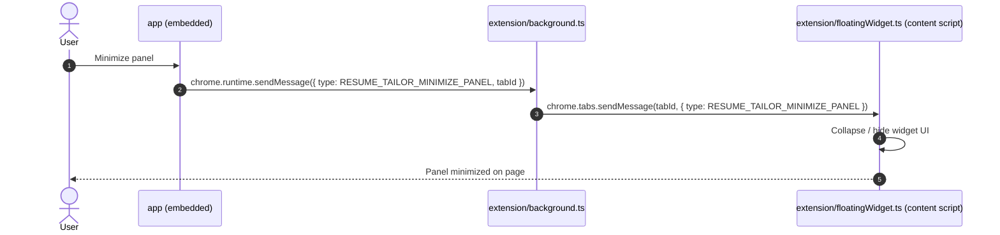
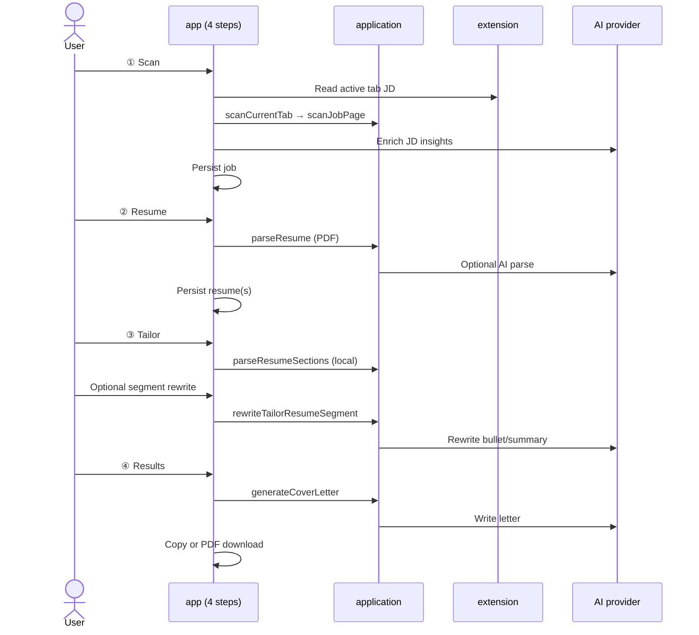

# Sequence Diagrams

Step-by-step call order for main flows. Companion to [ARCHITECTURE.md](./ARCHITECTURE.md) (layers and dependencies).

**Legend:** Solid calls stay in the extension; dashed arrows are **HTTPS to the user’s AI provider** (API key from local storage, no custom backend).

---

## Index

| # | Flow | Trigger |
|---|------|---------|
| [1](#1-app-startup-load-local-settings) | App startup | Extension UI opens |
| [2](#2-scan-job-page) | Scan job page | User clicks scan on Scan step |
| [3](#3-parse-resume-pdf) | Parse resume PDF | User uploads PDF on Resume step |
| [4](#4-generate-cover-letter) | Generate cover letter | User clicks generate on Results step |
| [5](#5-tailor-ai-rewrite-segment) | Tailor AI rewrite | User opens rewriter on Tailor step |
| [6](#6-floating-widget-minimize-panel) | Minimize floating panel | User minimizes embedded UI (optional) |

---

## 1. App startup (load local settings)



---

## 2. Scan job page

Orchestrated in `App.handleScanCurrentPage`: tab text → local JD shape → AI enrichment → `chrome.storage.local`.



**Notes**

- `extractJobInsights` runs inside `scanJobPage` before AI; the UI **replaces** requirements/keywords with the provider response.
- Raw JD text is never sent to a project-owned server—only to the provider the user configured.

---

## 3. Parse resume PDF

Entry: `ResumePage` → `application/parseResume`. Three paths: vision AI, plain-text AI, local sections.

```mermaid
sequenceDiagram
  autonumber
  actor User
  participant Resume as app/ResumePage
  participant App as app/App.tsx
  participant UC as application/parseResume
  participant PDF as infrastructure/pdfResumeParser
  participant AIParse as infrastructure/aiResumeParser
  participant Sections as application/parseResumeSections
  participant Provider as AI provider API
  participant Store as chromeStorageRepository

  User->>Resume: Choose PDF file(s)
  Resume->>Resume: Validate API key + PDF type

  Resume->>UC: parseResume(title, file, { apiKey, aiProvider })

  par Extract in parallel
    UC->>PDF: extractTextFromPdf(file)
    PDF-->>UC: rawText
    opt Vision-capable provider
      UC->>PDF: renderPdfPagesToImageDataUrls(file)
      PDF-->>UC: pageImages[]
    end
  end

  alt Vision path (OpenAI / Gemini + images)
    UC->>AIParse: parseResumeWithAiProviderFromPdfPageImages(images, key, provider)
    AIParse->>Provider: POST (vision + JSON resume shape)
    Provider-->>AIParse: sections
    AIParse-->>UC: ParsedResumeSections
    UC-->>Resume: Resume (parseSource: ai)
  else Plain-text AI path
    UC->>AIParse: parseResumeWithAiProviderFromPlainText(rawText, key, provider)
    AIParse->>Provider: POST (text + JSON resume shape)
    Provider-->>AIParse: sections
    AIParse-->>UC: ParsedResumeSections
    UC-->>Resume: Resume (parseSource: ai)
  else Local fallback
    UC->>Sections: parseResumeSections(rawText)
    Sections-->>UC: ParsedResumeSections
    UC-->>Resume: Resume (parseSource: local)
  end

  Resume->>App: onResumesAdd(resumes)
  App->>Store: setItem(currentResume), setItem(resumes[])
  App-->>User: Resume list updated; can continue to Tailor
```

---

## 4. Generate cover letter

Entry: `ResultsPage.handleGenerate` → `application/generateCoverLetter`.

```mermaid
sequenceDiagram
  autonumber
  actor User
  participant Results as app/ResultsPage
  participant UC as application/generateCoverLetter
  participant Chunks as application/listResumeChunksForCoverLetter
  participant Sections as application/parseResumeSections
  participant AI as infrastructure/openAiCoverLetterGenerator
  participant Provider as AI provider API

  User->>Results: Select keywords / requirements / resume chunks
  User->>Results: Click Generate cover letter

  alt Missing job, resume, API key, or selection
    Results-->>User: Error or open Settings
  else Ready
    Results->>UC: generateCoverLetter({ job, resume, selectedIds, apiKey, providerId })

    UC->>UC: Filter job.keywords / job.requirements by selection
    UC->>Chunks: listResumeChunksForCoverLetter(resume)
    Chunks->>Sections: parseResumeSections(resume fields)
    Sections-->>Chunks: chunk list
    Chunks-->>UC: selected resumeBlocks

    UC->>AI: generateCoverLetterWithAiProvider(prompt input)
    AI->>Provider: POST chat/completions
    Provider-->>AI: letter text (JSON)
    AI-->>UC: string
    UC-->>Results: CoverLetter { id, content, createdAt }

    Results->>Results: setCoverLetter(state)
    Results-->>User: Show letter; Copy / Download PDF

    opt Download PDF
      User->>Results: Download PDF
      Results->>Results: generateCoverLetterPdfBlob (infrastructure/pdf)
      Results->>Results: downloadBlob (infrastructure/export)
    end
  end
```

---

## 5. Tailor AI rewrite segment

Entry: `TailorAiRewriterDialog` on Tailor step. Rewrites summary or one experience bullet.



**Note:** Tailor edits are held in React state on `TailorPage` until the user saves or navigates; PDF preview uses `infrastructure/pdf` separately (not shown).

---

## 6. Floating widget: minimize panel

Used when the app runs inside the injected floating iframe (`?embed=floating-widget`). Some sites block direct `postMessage` from iframe → widget, so the service worker relays.



Constants are duplicated in `shared/floatingWidgetMessages.ts` and extension bundles (no cross-import) so `executeScript` stays a single file.

---

## End-to-end user journey (four steps)

High-level only—see sections above for call detail.



---

## Keeping diagrams accurate

After changing orchestration, update the matching section and re-check entry files:

| Flow | Primary files |
|------|----------------|
| Scan | `app/App.tsx`, `application/scanCurrentTab.ts`, `extension/tabs/readActiveTabText.ts` |
| Parse | `app/pages/ResumePage.tsx`, `application/parseResume.ts` |
| Cover letter | `app/pages/ResultsPage.tsx`, `application/generateCoverLetter.ts` |
| Tailor rewrite | `app/components/TailorAiRewriterDialog.tsx`, `application/rewriteTailorResumeSegment.ts` |
| Widget | `extension/background/background.ts`, `extension/content/floatingWidget.ts` |
